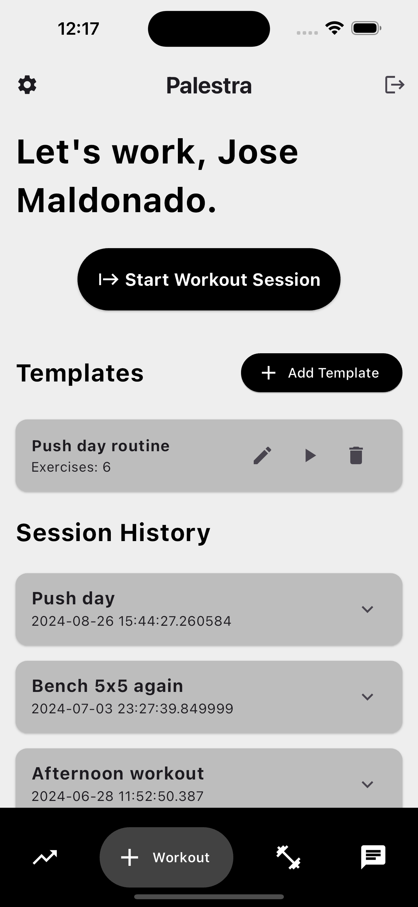
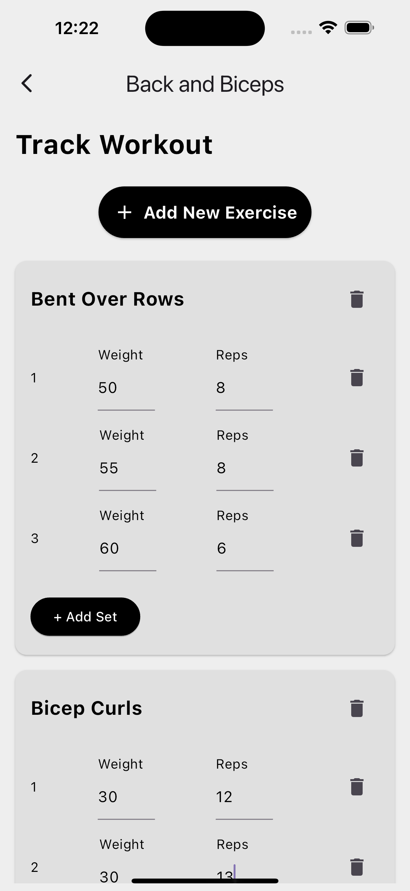
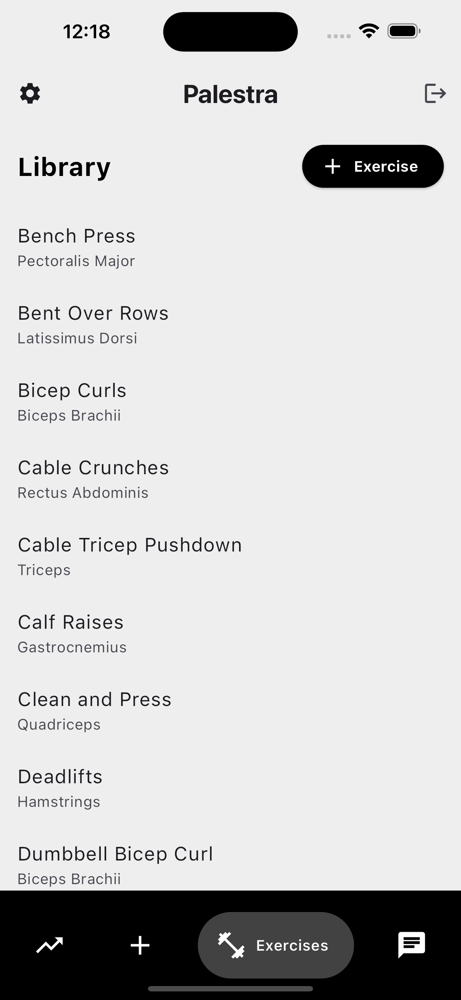
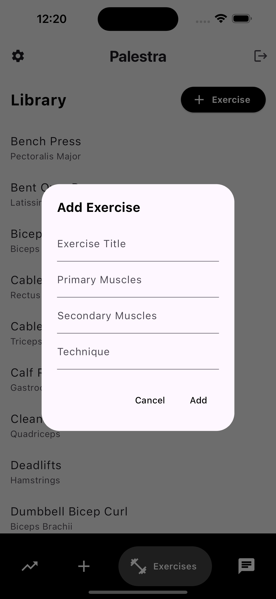
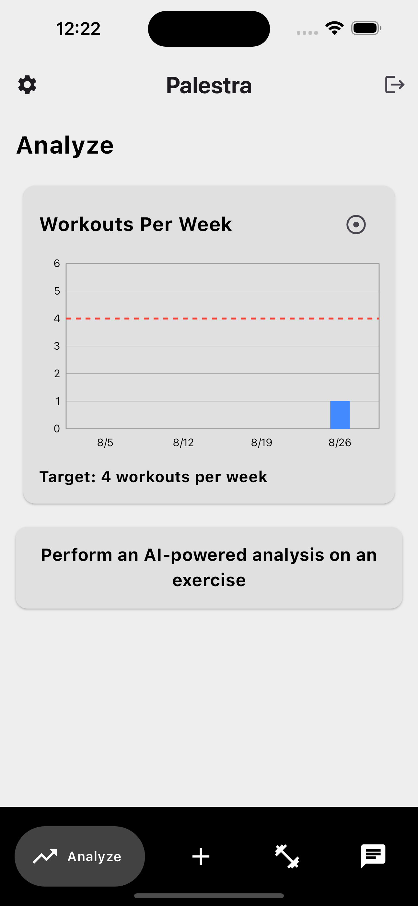
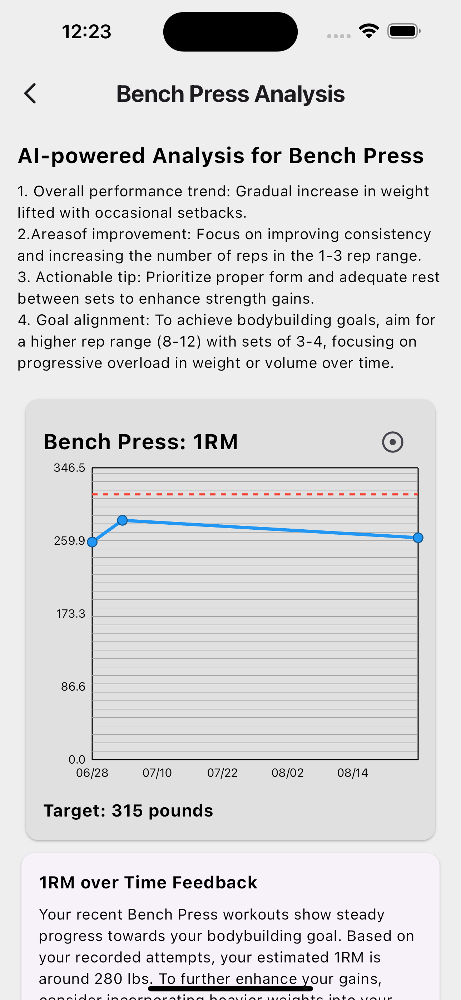
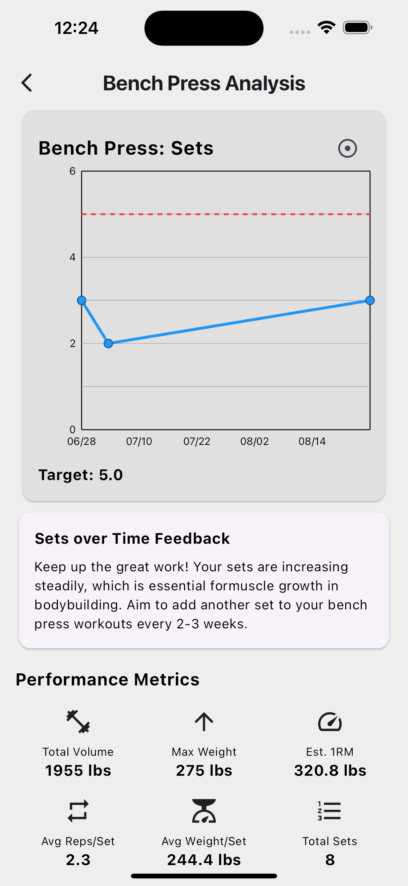
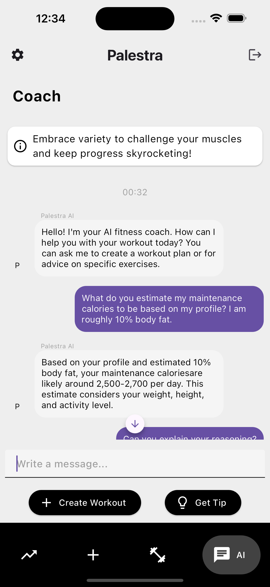
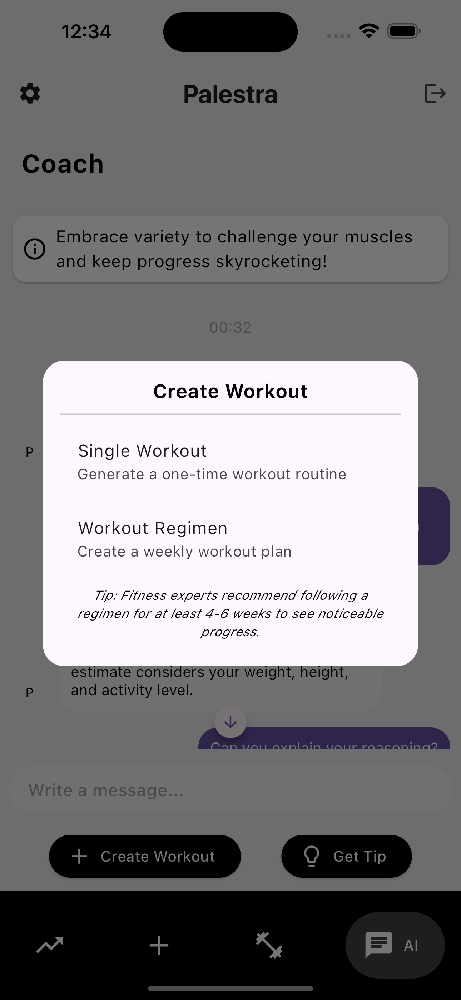
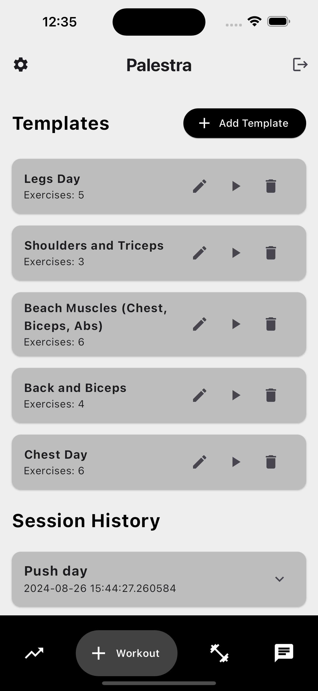

# Palestra

Palestra is a comprehensive Flutter-based fitness application designed to revolutionize your workout experience. With its three core features - Track, Analyze, and Create - Palestra empowers users to take control of their fitness journey like never before.

## Core Features

### 1. Track Workouts

Palestra provides a robust system for tracking your workouts with precision and ease:

- **Session Creation**: Quickly create new workout sessions or use templates for recurring routines.
- **Exercise Logging**: Record sets, reps, and weights for each exercise in real-time during your workout.
- **Custom Exercise Library**: Access a comprehensive database of exercises, including the ability to add your own custom exercises.
- **Template System**: Save favorite workouts as templates for quick access in future sessions.

Key components:
- The `Session` model manages workout data, including exercises, sets, reps, and weights.
- `SessionFirestore` service handles the storage and retrieval of workout sessions.
- `ExerciseFirestore` service manages the custom exercise database.

### 2. Analyze Workouts

Turn your workout data into actionable insights with Palestra's advanced analytics:

- **Exercise-Specific Analysis**: Dive deep into individual exercise performance over time.
- **AI-Powered Insights**: Receive personalized feedback and recommendations based on your progress.
- **Visual Progress Tracking**: View your progress through intuitive charts and graphs.
- **Performance Metrics**: Track key indicators like Total Volume, Max Weight, Estimated 1RM, and more.

The analysis feature leverages AI to provide tailored advice:
- `AnalyzeExercisePage` combines user data with AI insights for comprehensive exercise analysis.
- `GeminiService` creates personalized feedback and recommendations.
- `ExerciseAnalyticsCard` visualizes progress data using charts and graphs.
- `WorkoutsPerWeekCard` displays weekly workout frequency trends.

### 3. Create Workouts

Let Palestra's AI be your personal trainer, creating customized workout plans tailored to your goals:

- **Single Workout Creation**: Get AI-crafted workouts based on your preferences and available time.
- **Weekly Regimen Planning**: Receive a comprehensive weekly workout plan aligned with your fitness goals.
- **Smart Exercise Selection**: AI considers your profile, goals, and available equipment to suggest optimal exercises.
- **Adaptive Recommendations**: As you progress, the AI adapts its recommendations to keep challenging you.

The workout creation process:
- `AiPage` handles the interaction with the AI for workout creation.
- `GeminiService` processes user inputs and creates tailored workout plans.
- `ParseWorkout` utility converts AI responses into structured workout data.

## How It All Ties Together

Palestra creates a seamless fitness experience by integrating these core features:

1. **Track** your workouts meticulously, building a rich dataset of your exercise history.
2. **Analyze** this data to gain insights into your progress and areas for improvement.
3. **Create** new workouts based on your personal profile, tracked data and workout analysis, ensuring continual progress and variety in your routines.

This cycle of tracking, analyzing, and creating creates a personalized fitness journey that evolves with you. The AI-powered recommendations become more refined as you input more data, leading to increasingly effective workout plans.

## Technical Overview

Palestra is built with cutting-edge technologies to ensure a smooth, responsive, and intelligent user experience:

- **Firebase Integration**: Utilizes Firebase for real-time data synchronization and user authentication.
- **Flutter Framework**: Ensures a responsive and native-feeling app across both iOS and Android platforms.
- **Gemini AI**: Powers the intelligent workout analysis and creation features.
- **Custom Analytics**: Employs `fl_chart` for creating insightful visual representations of your progress.

## Getting Started

To experience Palestra's revolutionary approach to fitness:

1. Ensure you have Flutter installed on your machine.
2. Clone the repository.
3. Run `flutter pub get` to install dependencies.
4. Set up a Firebase project and add the necessary configuration files.
5. Set up the Gemini API key in the appropriate configuration file.
6. Run the app using `flutter run`.

Join Palestra today and transform your fitness journey with the power of AI-driven tracking, analysis, and workout creation!